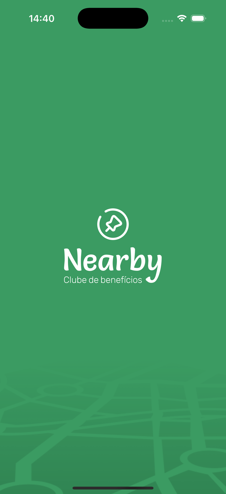
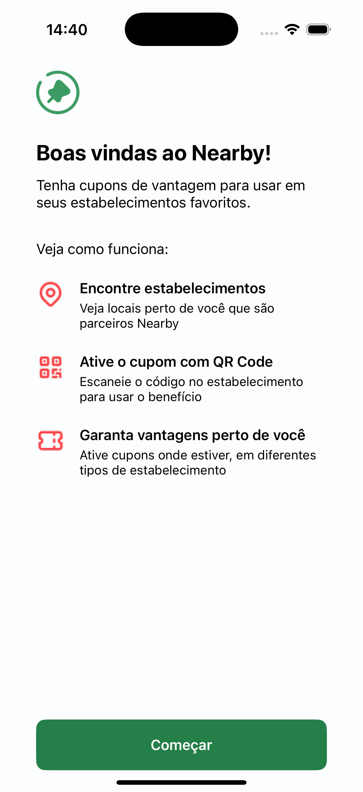

 
  

<h1 align="center">Nearby</h1>

  <a href="#dart-about">About</a> &#xa0; | &#xa0; 
  <a href="#sparkles-features">Features</a> &#xa0; | &#xa0;
  <a href="#rocket-technologies">Technologies</a> &#xa0; | &#xa0;
  <a href="#white_check_mark-requirements">Requirements</a> &#xa0; | &#xa0;
  <a href="#checkered_flag-starting">Starting</a> &#xa0; | &#xa0;
  <a href="#memo-license">License</a> &#xa0; | &#xa0;
  <a href="https://github.com/{{YOUR_GITHUB_USERNAME}}" target="_blank">Author</a>

 

## :dart: About

Project developed in Swift by the RocketSeat Pocket mobile event. Project designed to manage discount coupons for previously registered establishments.

## :sparkles: Features

:heavy_check_mark: Swift;\
:heavy_check_mark: Map;\
:heavy_check_mark: BackEnd;

## :rocket: Technologies

The following tools were used in this project:

- [Swift](https://www.apple.com/br/swift/)

## :white_check_mark: Requirements

- MacOS environment
- Xcode 16
- iOS 18.1

## :checkered_flag: Starting

To run the project, you need an Apple computer or a virtual machine environment running the MacOS operating system. This project was developed with XCode 16 and iOS 18.1.

Open the project in XCode and run the build command.
Extract the `api` project that is in the root of the repository, enter the `api` folder and run the `num run dev` command to start the server.

 
  
  
  
  
  

## :memo: License

This project is under license from MIT. For more details, see the [LICENSE](LICENSE.md) file.

<table>
  <tr>
    <td align="center"><a href="https://github.com/jhonathanqz"> <b>Jhonathan C. Queiroz</b></a>  <a href="https://github.com/jhonathanqz" title="Autor">😎</a></td>
  </tr>
  
</table>

Projeto gerenciado por <a href="https://github.com/jhonathanqz" target="_blank">Jhonathan Queiroz</a>

<a href="#top">Back to top</a>
